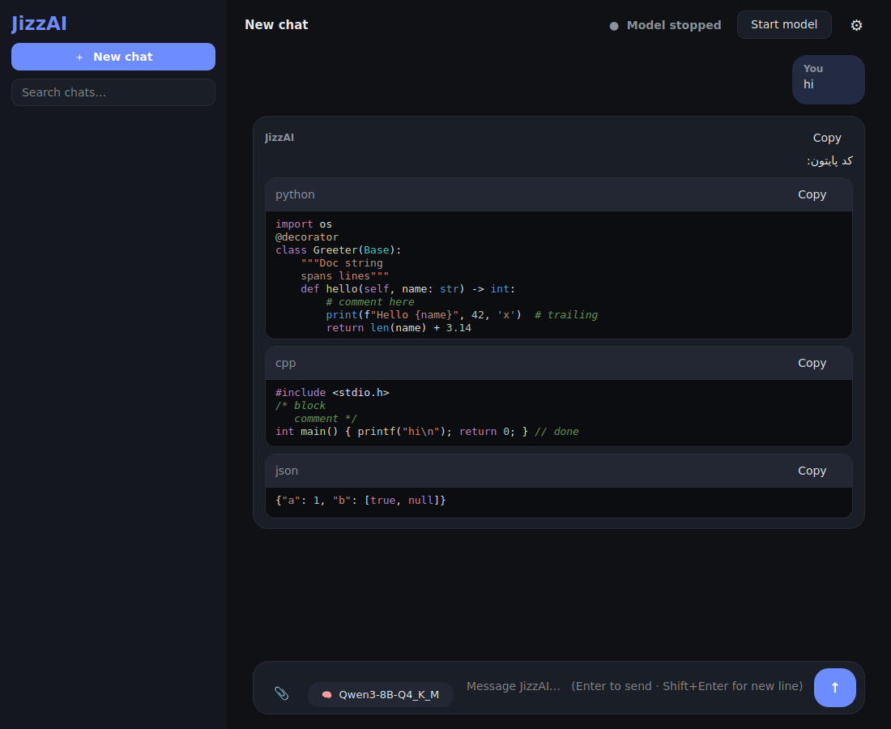
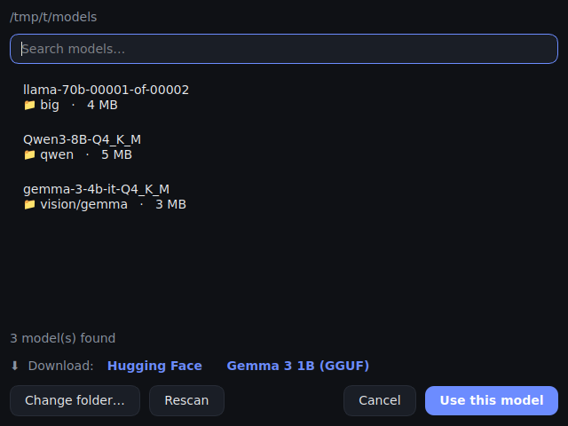
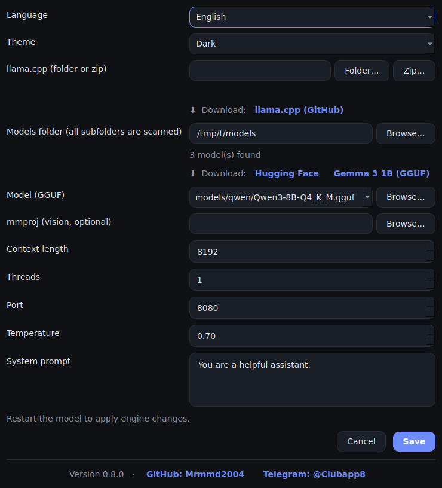

# JizzAI — a modern desktop chat UI for llama.cpp

**JizzAI** is a lightweight Windows desktop app that lets you chat with local LLMs (GGUF models) through
[llama.cpp](https://github.com/ggml-org/llama.cpp)'s `llama-server`. Everything runs offline on your own PC —
no cloud, no account, no API key.

English + Persian (RTL) interface · dark/light theme · chat history · drag & drop files

**Version 1.8.0 · Windows 10/11 · 64-bit (x64)** — the exe, installer and portable build are all **x64**.

🇮🇷 **[مستندات فارسی ← Persian documentation below](#فارسی)**



## Features

- **Local & private** – runs `llama-server` on `127.0.0.1`; your chats are saved on your PC only
- **Pick your llama.cpp** – choose the extracted llama.cpp folder (or the zip) — `llama-server.exe` is found automatically, even in sub-folders
- **Models folder browser** – choose a folder once; every `.gguf` model inside it and its sub-folders is listed
  (split models like `*-00001-of-00003.gguf` are listed once)
- **One-click model switch** – the 🧠 button next to the message box lists your models; pick one and (if the model is running) restart it with the new one
- **Vision models** – the matching `mmproj` file next to a model is selected automatically; attach images to chat
- **Code blocks with Copy button** and syntax colouring (Python, C/C++, JS/TS, Java, Go, Rust, Bash, SQL, JSON, HTML …)
- **Thinking models** – reasoning is shown in a collapsible "Thought process" section
- **Attach files** – drag & drop or 📎: text, code, `.docx`, `.pdf` (needs `pypdf`), images
- **Chat history** – search, rename, delete, export to Markdown
- **Smart behavior options** – auto-start the model when you press Send, auto-scroll while the answer is written, automatic chat titles, adjustable text size, max answer length, and a *scroll to latest message* button
- **Persian / English UI**, dark / light theme
- **64-bit (x64) build** – `JizzAI.exe`, `Setup.exe` and `Portable.exe` are built for x64 Windows
- **Installer, portable build** – one command builds the x64 `Setup.exe`, `Portable.exe` and a portable zip

| Model picker | Settings |
|---|---|
|  |  |

## Quick start (run from source)

1. Install [Python 3.10+](https://www.python.org/downloads/) (Windows, **64-bit / x64**)
2. Install the requirements:
   ```bash
   pip install -r requirements.txt
   ```
3. Download **llama.cpp** for Windows from the
   [llama.cpp releases](https://github.com/ggml-org/llama.cpp/releases) (e.g. `llama-bXXXX-bin-win-cpu-x64.zip`) and extract it
4. Download a **GGUF model**, for example
   [Gemma 3 1B (GGUF)](https://huggingface.co/unsloth/gemma-3-1b-it-GGUF/tree/main) from [Hugging Face](https://huggingface.co/)
5. Run:
   ```bash
   python jizzai.py
   ```
6. Open **Settings (⚙)** → set the **llama.cpp folder** and the **Models folder** → click **Start model** → chat!

## Build the exe / installer (x64)

JizzAI is built as a **64-bit (x64)** application. `build.py` checks that you are using 64-bit Python and stops with an
error if not, and it prefers the `x64` llama.cpp zip (e.g. `llama-bXXXX-bin-win-cpu-x64.zip`). The installer is x64-only
(`ArchitecturesAllowed=x64compatible`) and installs into `Program Files` (64-bit).

Put `jizzai.py`, `build.py`, `jizzai.iss`, `make_icon.py`, `icon.ico` and the llama.cpp zip in one folder, then:

```bash
python build.py
```

It creates (in `output/`): `JizzAI-<version>-Setup.exe`, `JizzAI-<version>-Portable.exe` and `JizzAI-<version>-Portable.zip`
with llama.cpp bundled inside. [Inno Setup](https://jrsoftware.org/isinfo.php) is needed for the two `.exe` files
(use `--skip-installer` to only build the portable zip). More options are listed at the top of `build.py`.

## Tips

- Drag a **models folder** or a **llama.cpp folder / zip** onto the window — JizzAI recognises which one it is
- Drag a single `.gguf` onto the window to select it as the model (`mmproj` files are detected by name)
- Portable mode: a `portable.flag` file next to the exe keeps settings and chats in `data/`
- Images need a vision model **and** its `mmproj` file
- Requires 64-bit Windows (x64); 32-bit Windows is not supported

## Links

- GitHub: [Mrmmd2004](https://github.com/Mrmmd2004)
- Telegram: [@Clubapp8](https://t.me/Clubapp8)

---

## فارسی

<div dir="rtl">

# JizzAI — رابط گفتگوی مدرن دسکتاپ برای llama.cpp

**JizzAI** یک برنامه‌ی سبک دسکتاپ برای ویندوز است که با آن می‌توانی با مدل‌های هوش مصنوعی محلی (فرمت GGUF) از طریق `llama-server` برنامه‌ی
[llama.cpp](https://github.com/ggml-org/llama.cpp) گفتگو کنی. همه‌چیز آفلاین و روی کامپیوتر خودت اجرا می‌شود؛
بدون سرویس ابری، بدون حساب کاربری و بدون کلید API.

رابط فارسی و انگلیسی · پوسته‌ی تیره و روشن · تاریخچه‌ی گفتگو · کشیدن و رها کردن فایل

**نسخه‌ی ۱.۸.۰ · ویندوز ۱۰/۱۱ · ۶۴ بیتی (x64)** — فایل exe، نصاب و نسخه‌ی پرتابل همگی **x64** ساخته می‌شوند.

### امکانات

- **محلی و خصوصی** – `llama-server` روی `127.0.0.1` اجرا می‌شود و گفتگوها فقط روی کامپیوتر خودت ذخیره می‌شوند
- **انتخاب llama.cpp** – پوشه‌ی استخراج‌شده (یا فایل zip) را بده؛ `llama-server.exe` حتی داخل زیرپوشه‌ها هم خودکار پیدا می‌شود
- **مرورگر پوشه‌ی مدل‌ها** – یک بار پوشه را انتخاب کن؛ همه‌ی فایل‌های `.gguf` داخل آن و زیرپوشه‌هایش لیست می‌شوند
  (مدل‌های تکه‌تکه مثل `*-00001-of-00003.gguf` فقط یک بار نمایش داده می‌شوند)
- **تعویض مدل با یک کلیک** – دکمه‌ی 🧠 کنار جعبه‌ی پیام مدل‌ها را لیست می‌کند؛ یکی را انتخاب کن و اگر مدل در حال اجراست، با مدل جدید دوباره اجرا می‌شود
- **مدل‌های بینایی** – فایل `mmproj` کنار مدل خودکار انتخاب می‌شود و می‌توانی تصویر ارسال کنی
- **کدها در باکس جدا با دکمه‌ی کپی** و رنگ‌بندی (Python، C/C++، JS/TS، Java، Go، Rust، Bash، SQL، JSON، HTML و …)
- **مدل‌های متفکر** – فرایند فکر کردن در بخش جمع‌شونده‌ی «فرایند فکر کردن» نمایش داده می‌شود
- **پیوست فایل** – کشیدن و رها کردن یا 📎: متن، کد، `.docx`، `.pdf` (نیازمند `pypdf`) و تصویر
- **تاریخچه‌ی گفتگو** – جستجو، تغییر نام، حذف و خروجی Markdown
- **گزینه‌های رفتار برنامه** – اجرای خودکار مدل با زدن ارسال، اسکرول خودکار هنگام نوشته شدن پاسخ، نام‌گذاری خودکار گفتگوها، تنظیم اندازه‌ی متن، حداکثر طول پاسخ و دکمه‌ی «رفتن به آخرین پیام»
- **رابط فارسی / انگلیسی** و پوسته‌ی تیره / روشن
- **ساخت ۶۴ بیتی (x64)** – `JizzAI.exe`، `Setup.exe` و `Portable.exe` برای ویندوز x64 ساخته می‌شوند
- **نصاب و نسخه‌ی پرتابل** – با یک دستور `Setup.exe`، `Portable.exe` و zip پرتابل (همگی x64) ساخته می‌شود

### شروع سریع (اجرا از سورس)

1. [Python 3.10+](https://www.python.org/downloads/) (ویندوز، **۶۴ بیتی / x64**) را نصب کن
2. نیازمندی‌ها را نصب کن:
   ```bash
   pip install -r requirements.txt
   ```
3. نسخه‌ی ویندوز **llama.cpp** را از
   [صفحه‌ی releases](https://github.com/ggml-org/llama.cpp/releases) دانلود کن (مثلاً `llama-bXXXX-bin-win-cpu-x64.zip`) و استخراج کن
4. یک **مدل GGUF** دانلود کن، مثلاً
   [Gemma 3 1B (GGUF)](https://huggingface.co/unsloth/gemma-3-1b-it-GGUF/tree/main) از [Hugging Face](https://huggingface.co/)
5. اجرا کن:
   ```bash
   python jizzai.py
   ```
6. **تنظیمات (⚙)** را باز کن ← **پوشه‌ی llama.cpp** و **پوشه‌ی مدل‌ها** را بده ← **اجرای مدل** را بزن ← گفتگو کن!

### ساخت exe و نصاب (x64)

برنامه به‌صورت **۶۴ بیتی (x64)** ساخته می‌شود. `build.py` بررسی می‌کند که پایتون ۶۴ بیتی باشد و در غیر این صورت با خطا متوقف می‌شود؛ همچنین zip نسخه‌ی `x64` برنامه‌ی llama.cpp
(مثلاً `llama-bXXXX-bin-win-cpu-x64.zip`) را ترجیح می‌دهد. نصاب فقط روی x64 نصب می‌شود (`ArchitecturesAllowed=x64compatible`) و در `Program Files` ۶۴ بیتی نصب می‌شود.

فایل‌های `jizzai.py`، `build.py`، `jizzai.iss`، `make_icon.py`، `icon.ico` و zip برنامه‌ی llama.cpp را در یک پوشه بگذار و اجرا کن:

```bash
python build.py
```

در پوشه‌ی `output/` این فایل‌ها ساخته می‌شوند: `JizzAI-<version>-Setup.exe`، `JizzAI-<version>-Portable.exe` و `JizzAI-<version>-Portable.zip`
(llama.cpp داخلشان گنجانده شده است). برای ساخت دو فایل `.exe` برنامه‌ی [Inno Setup](https://jrsoftware.org/isinfo.php) لازم است
(با `--skip-installer` فقط zip پرتابل ساخته می‌شود). گزینه‌های بیشتر در ابتدای `build.py` توضیح داده شده‌اند.

### نکته‌ها

- **پوشه‌ی مدل‌ها** یا **پوشه / zip برنامه‌ی llama.cpp** را روی پنجره بکش؛ JizzAI تشخیص می‌دهد کدام است
- یک فایل `.gguf` را روی پنجره بکش تا به‌عنوان مدل انتخاب شود (فایل‌های `mmproj` از روی نامشان تشخیص داده می‌شوند)
- حالت پرتابل: فایل `portable.flag` کنار exe باعث می‌شود تنظیمات و گفتگوها داخل پوشه‌ی `data/` ذخیره شوند
- برای تصویر به یک مدل بینایی **و** فایل `mmproj` آن نیاز است
- به ویندوز ۶۴ بیتی (x64) نیاز دارد؛ ویندوز ۳۲ بیتی پشتیبانی نمی‌شود

### لینک‌ها

- GitHub: [Mrmmd2004](https://github.com/Mrmmd2004)
- Telegram: [@Clubapp8](https://t.me/Clubapp8)

</div>
